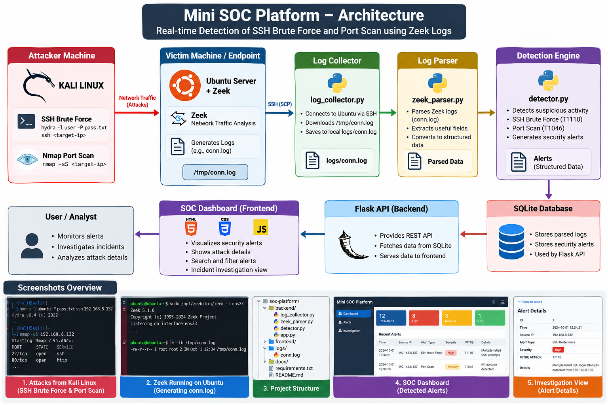
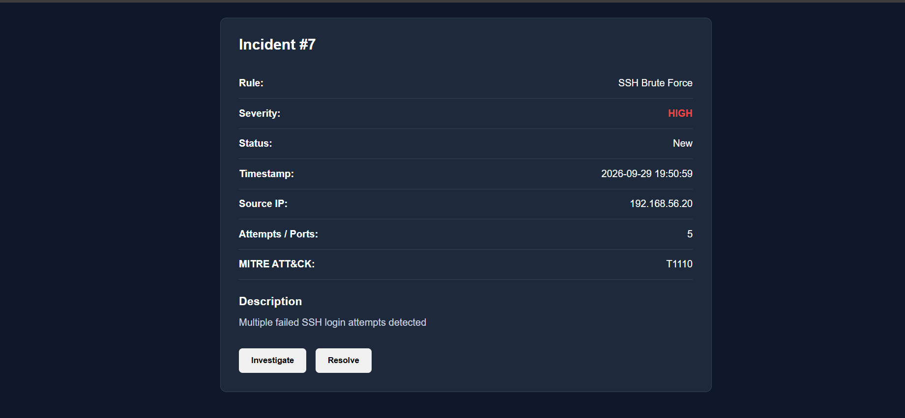
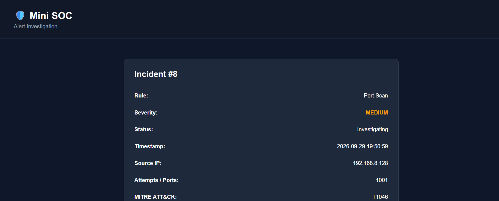
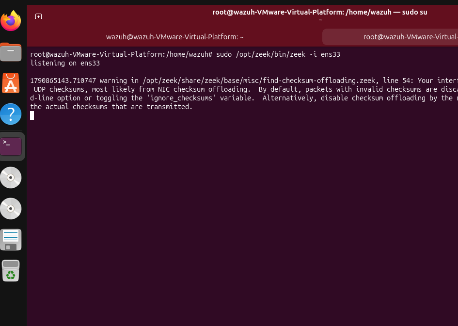
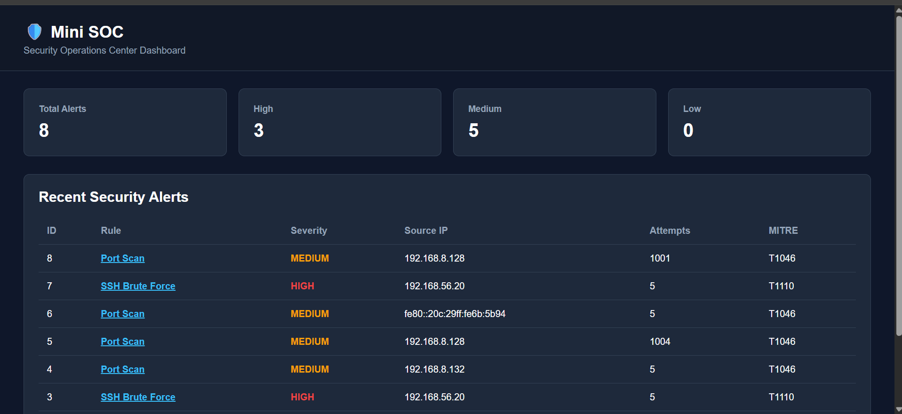
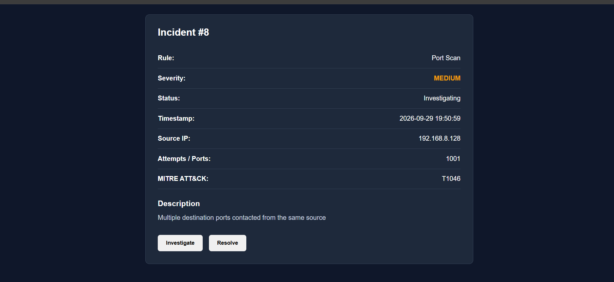

# 🛡️ Mini SOC Platform

A lightweight Security Operations Center (SOC) platform built for a controlled cybersecurity lab environment. The project demonstrates a complete detection workflow from attack simulation and network telemetry collection to alert generation and incident investigation.

## 📌 Overview

The Mini SOC Platform currently detects two security activities:

- **SSH Brute Force**
- **Network Port Scan**

The platform uses **Zeek** for network telemetry, Python for parsing and detection, SQLite for alert storage, and Flask + HTML/CSS/JavaScript for the SOC dashboard.

---

## 🏗️ Architecture



### Detection and Investigation Flow

```text
Kali Linux
   │
   ├── SSH Brute Force
   └── Nmap Port Scan
           │
           ▼
Ubuntu Server + Zeek
           │
           ▼
      Zeek conn.log
           │
           ▼
    log_collector.py
           │
           ▼
      zeek_parser.py
           │
           ▼
       detector.py
           │
           ▼
      SQLite Database
           │
           ▼
        Flask API
           │
           ▼
      SOC Dashboard
           │
           ▼
   Alert Investigation
```

---

## 🧰 Technology Stack

| Area | Technology |
|---|---|
| Attacker | Kali Linux |
| Endpoint | Ubuntu Server |
| Network Monitoring | Zeek |
| Backend | Python |
| Web Framework | Flask |
| Database | SQLite |
| Frontend | HTML, CSS, JavaScript |
| Network Scanning | Nmap |
| SSH Testing | Hydra |
| Log Transfer | SCP |
| Virtualization | VMware |

---

## 🔍 Detection 1 — SSH Brute Force

The platform detects repeated failed SSH authentication attempts from the same source IP.

**Detection threshold:** 5 failed attempts  
**Severity:** HIGH  
**MITRE ATT&CK:** T1110

### Workflow

```text
SSH Login Failures
        ↓
   parser.py
        ↓
Count failures by source IP
        ↓
  ≥ 5 attempts
        ↓
SSH Brute Force Alert
```



---

## 🔎 Detection 2 — Network Port Scan

The platform uses real Zeek `conn.log` telemetry to detect a source contacting multiple destination ports.

**Detection threshold:** 5 unique destination ports  
**Severity:** MEDIUM  
**MITRE ATT&CK:** T1046

### Workflow

```text
Nmap Port Scan
      ↓
Network Traffic
      ↓
     Zeek
      ↓
  conn.log
      ↓
zeek_parser.py
      ↓
 detector.py
      ↓
 Port Scan Alert
```



---

## 🌐 Zeek Network Monitoring

Zeek runs on the Ubuntu endpoint and monitors the selected network interface.

Example:

```bash
sudo /opt/zeek/bin/zeek -i ens33
```

Zeek generates several logs. This project uses:

```text
conn.log
```

The log contains connection information such as source IP, destination IP, destination port, and protocol.



---

## 📥 Log Collection

`log_collector.py` retrieves the Zeek log from the Ubuntu endpoint using SCP.

```text
Ubuntu
  │
  │ /tmp/conn.log
  ▼
SCP
  │
  ▼
logs/conn.log
```

The collected log is then passed to the Zeek parser.

---

## 🧩 Log Parsing

`zeek_parser.py` converts Zeek's tab-separated connection records into structured Python events.

Example fields include:

```text
Source IP
Destination IP
Destination Port
Protocol
Raw Log
```

These structured events are passed to the detection engine.

---

## ⚙️ Detection Engine

Detection logic is implemented in:

```text
backend/detector.py
```

Current rules:

```text
1. SSH Brute Force
2. Port Scan
```

When a rule threshold is reached, the engine creates a structured security alert containing:

- Detection rule
- Severity
- Source IP
- Attempt/port count
- Description
- MITRE ATT&CK technique

---

## 🗄️ SQLite Database

Generated alerts are stored in SQLite.

Each alert contains:

```text
ID
Timestamp
Rule
Severity
Source IP
Attempts / Ports
Description
MITRE ATT&CK
Status
```

Alert status can be updated to:

```text
New
Investigating
Resolved
```

---

## 🖥️ SOC Dashboard

The Flask application provides the backend API and serves the frontend dashboard.

The dashboard displays:

- Total alerts
- High severity alerts
- Medium severity alerts
- Low severity alerts
- Detection rule
- Source IP
- Attempts / ports
- MITRE ATT&CK technique



---

## 🔬 Alert Investigation

Selecting an alert opens the investigation view.

The analyst can review:

- Incident ID
- Detection rule
- Severity
- Status
- Timestamp
- Source IP
- Attempts / ports
- MITRE ATT&CK technique
- Alert description

The analyst can update the incident status to **Investigating** or **Resolved**.



---

## 🧪 Attack and Detection Demonstration

### Port Scan

A controlled Nmap scan is performed from Kali Linux against the Ubuntu lab endpoint. Zeek records the resulting network connections, which are then parsed and evaluated by the detection engine.


### SSH Brute Force

Controlled SSH authentication attempts are generated from the Kali Linux lab machine. The failed authentication events are parsed and evaluated against the SSH brute-force threshold.


---

## 🖥️ Lab Environment

The project was tested using isolated virtual machines.

```text
Kali Linux
    │
    │ Security Testing
    ▼
Ubuntu Server
    │
    └── Zeek
```


---

## 📁 Project Structure

```text
SOC/
├── backend/
│   ├── app.py
│   ├── parser.py
│   ├── detector.py
│   ├── database.py
│   ├── check_db.py
│   ├── network_parser.py
│   ├── zeek_parser.py
│   └── log_collector.py
│
├── frontend/
│   ├── index.html
│   ├── style.css
│   ├── app.js
│   ├── investigation.html
│   └── investigation.js
│
├── docs/
│   ├── architecture.png
│   ├── dashboard.png
│   ├── investigate.png
│   ├── port-scan.png
│   ├── scan-and-detection.png
│   ├── ssh-bruteforce.png
│   ├── zeek.png
│   └── lab-setup.png
│
├── logs/
├── reports/
├── rules/
├── tests/
├── requirements.txt
├── .gitignore
└── README.md
```

---

## 🚀 Installation

### 1. Clone the repository

```bash
git clone https://github.com/rahilparvez07/soc-platform.git
cd soc-platform
```

### 2. Create a Python virtual environment

Windows:

```cmd
py -m venv venv
venv\Scriptsctivate
```

### 3. Install dependencies

```cmd
pip install -r requirements.txt
```

### 4. Start the Flask application

```cmd
cd backend
py app.py
```

Open:

```text
http://127.0.0.1:5000
```

---

## 🔐 Security Notes

This project is intended for authorized cybersecurity testing and educational lab environments.

Do not upload:

- Passwords
- API keys
- SSH private keys
- Sensitive production logs
- Sensitive database files

The `.gitignore` file excludes local secrets, virtual environments, databases, and log files.

---

## ⚠️ Disclaimer

Use this project only against systems you own or have explicit permission to test. The attack simulations shown in this project are intended for an isolated cybersecurity lab.

---

## 👨‍💻 Author

**Rahil Parvez**


